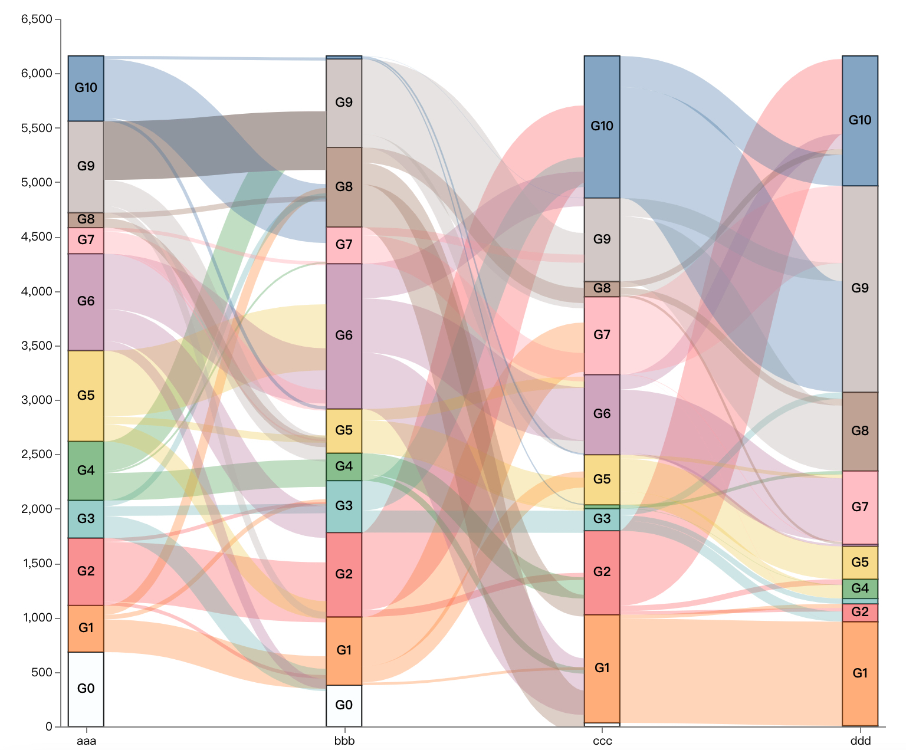

# @bugonly/stacked-sankey-chart

Stacked Bar vs Sankey 融合图表

;

## 安装
```bash
npm install @bugonly/stacked-sankey-chart
```

## 使用
### API

```typescript
/**
 * 源数据原始
 */ 
interface ISourceItem {
  source_exam_id: string;
  source_group_no: string;
  target_exam_id: string;
  target_group_no: string;
  source_group_num: number;
  target_group_num: number;
  source_to_target: number;
}
/**
 * 渲染配置
 */
interface IRenderOpts {
  /**
   * 柱子的宽度
   */
  barWidth: number;
  /**
   * 是否显示每个分组的border
   */
  showBarBorder?: boolean;
  /**
   * 显示分组标签的尺寸边界，小于此值不显示
   */
  labelLimitSize?: number;
  /**
   * 指定特殊分组的颜色显示
   */
  nonRoutineGroup?: {
    // 分组ID
    groupId: string;
    // 分组颜色
    groupColor: string;
    // 连接线颜色，如果不指定则使用 groupColor
    lineColor?: string;
  };
  /**
   * 解析数据失败回调函数
   */
  onParseDataFail?: (err?:Error)=>any;
}
/**
 * 创建图表函数
 */ 
createVegaSankeyChart(source: ISourceItem[], opts: {
  /**
   * 渲染配置
   */ 
  renderOption: IRenderOpts;
  /**
   * vega View配置
   * @see https://vega.github.io/vega/docs/config/#view
   */ 
  vegaViewOpts?: any;
}): vega.View
```

#### 示例
```typescript
import { createVegaSankeyChart } from '@bugonly/stacked-sankey-chart';

const chart = createVegaSankeyChart(sourceData, {
  renderOption: {
    barWidth: 30,
    labelLimitSize: 10,
    showBarBorder: true,
    nonRoutineGroup: {
      groupId: 'G0',
      groupColor: '#f0f8ff4a',
      lineColor: '#00000000'
    }
  },
  vegaViewOpts: {
    resize: "fit",
    renderer: "canvas", // renderer (canvas or svg)
    container: "#view", // parent DOM container
    hover: true, // enable hover processing
  }
});
chart.height(600);
chart.width(700);
chart.runAsync();
```